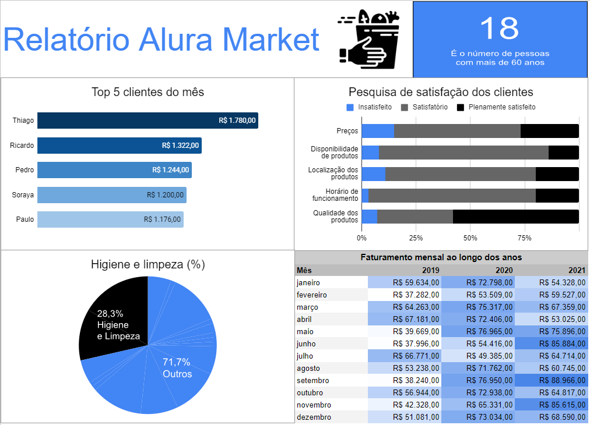

# Projetos de Análise de Dados com Excel e Google Sheets

Projetos realizados durante as minhas formações "Excel" e "Data Analysis com Google Sheets" na Alura.

| :placard: Vitrine.Dev | [cursos.alura.com.br/vitrinedev/paulo-emilio](https://cursos.alura.com.br/vitrinedev/paulo-emilio) |
| -------------  | --- |
| :sparkles: Nome        | **Data Analysis com Excel e Google Sheets**
| :label: Tecnologias | excel, google sheets
| :rocket: URL        | [Dashboard de Controle de Rotas no Excel](https://1drv.ms/x/s!AiFjwGBG_LP41UI6SX_aRP8mGLXX?e=iC76bP) [Relatório de Análise de Dados Alura Market](https://docs.google.com/spreadsheets/d/1_6NjF84UREH427WEjHjJx-LYnk-lknzfwNVP-voViqw/edit?usp=sharing)

<!-- Inserir imagem com a #vitrinedev ao final do link -->

## Detalhes do projeto

Estes projetos foram desenvolvidos durante as minhas formações "Excel" e "Data Analysis com Google Sheets" na Alura. Durante os cursos, utilizei dados para análises, criação de dashboards, tabelas e muito mais.
